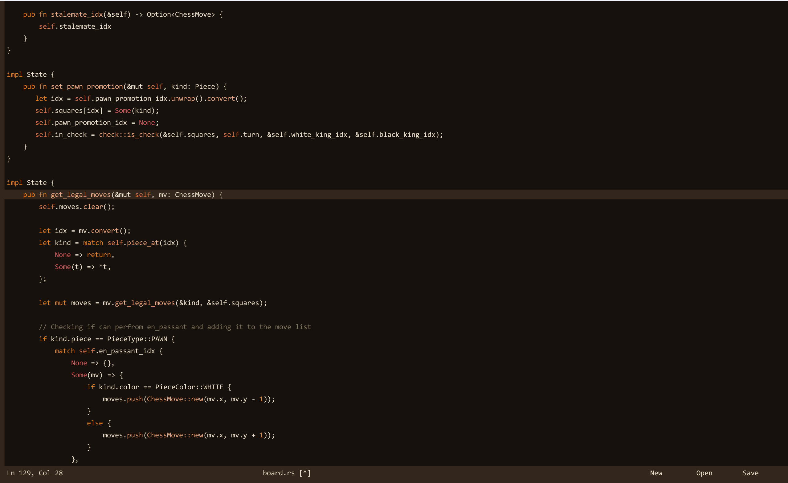

# Text-Editor

A custom Java text editor engine built from scratch.  

Features:
- Undo/Redo
- Opening, Saving, and creating new files
- Custom rendering
- Used a GapBuffer data structure
- Custom cursor logic

I have also included a design doc that goes into more details and explains some of my decisions when developing the editor.

How to run: This repo includes all of the soure code, to run this editor make sure all java files are in the same location.  
If using a IDE like vscode then run the main file.  
From the command line, to compile the files run: javac -d bin src/*.java, and to run the program run: java -cp bin Main

